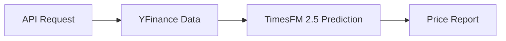
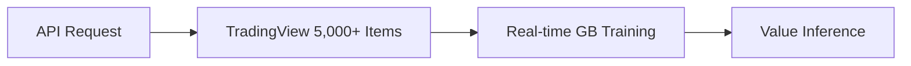
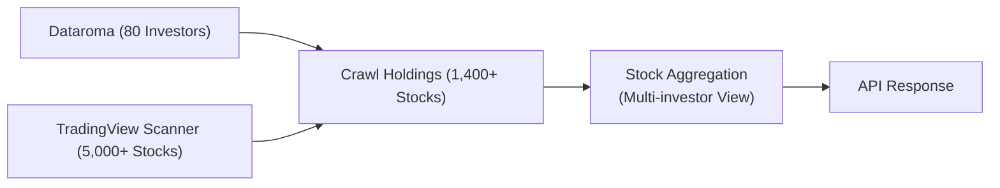
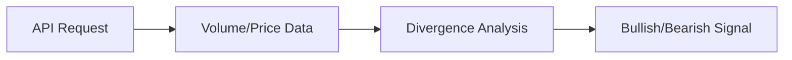

# 🚀 [PORTFOLIO] AI 기반 금융 분석 및 지능형 트레이딩 인프라

> **"최첨단 AI 시계열 예측, 실시간 ML 가치 추론, 고래 수급 분석이 결합된 클라우드 네이티브 AI 백엔드"**

## 👤 프로젝트 개요
본 프로젝트는 **데이터가 지능이 되는 과정**을 백엔드 설계로 구현한 차세대 금융 인델리전스 시스템입니다. Google DeepMind의 **TimesFM 2.5**를 활용한 가격 예측, **Scikit-Learn 기반의 실시간 기업 가치 추론**, 그리고 **알고리즘 기반 수급 분석**을 통합했습니다. 특히 **Motia 프레임워크**와 **Hugging Face GPU 인프라**를 활용하여, 무거운 AI 모델 서빙과 실시간 기계학습을 동시에 구현한 아키텍처가 핵심입니다.

---

## 🛠 핵심 플랫폼 및 기술 스택

### 1. Motia Framework Mastery
- **Multi-Runtime Orchestration**: Node.js(네트워크)와 Python(AI 연산)의 강점을 최적으로 결합.
- **Event-Driven Micro-steps**: 작업을 작은 Step 단위로 쪼개고 이벤트를 통해 연결하여 결합도 최소화.

### 2. Hugging Face Cloud-Native Deployment
- **Docker SDK 기반 배포**: GPU(VRAM) 가속을 위한 컨테이너 환경 구축.
- **CI/CD Automation**: GitHub 연동을 통한 완전 자동화된 배포 파이프라인.

---

## 🏗 시스템 핵심 워크플로우 (Flows)

### [Flow 1: AI 시계열 가격 예측 (Forecast)]
최신 파운데이션 모델을 사용하여 비트코인의 단기(24h) 및 중기(30d) 추세를 예측합니다.
- **사용 모델**: `Google TimesFM 2.5 (200M/500M)`

### [Flow 2: 지능형 시가총액 추론 (Market Cap)]
수천 개의 종목 데이터를 **실시간으로 학습(On-the-fly Training)**하여 적정 시가총액을 유추합니다.
- **학습 모델**: `HistGradientBoostingRegressor (Scikit-learn)`
- **특이사항**: 매 요청 시 현재 시장 데이터를 수집하여 즉석에서 모델을 학습시키고 가치를 추론합니다.

### [Flow 2.1: 포트폴리오 가격 조회 (Portfolio Pricing)]
유명 투자자 80명의 보유 종목에 대해 **TradingView의 실시간 가격 데이터**를 우선으로 활용합니다.
- **데이터 원천**: `Dataroma (투자자 포트폴리오)` + `TradingView (가격/거래소)`
- **폴백 전략**: TradingView에 없는 종목은 yfinance 활용

### [Flow 3: 고래 수급 및 이탈 탐지 (Whale Tracking)]
가격 뒤에 숨겨진 자금의 흐름을 분석하여 세력의 매집과 이탈 징후를 포착합니다.
- **분석 알고리즘**: `VWAP & OBV Divergence Analysis`

---

## 🌟 핵심 기술적 성과

### 1. 최첨단 AI 서빙 및 최적화
- **Lazy Loading & Singleton**: 1GB 이상의 무거운 `TimesFM` 모델을 메모리에 상주시키며 호출 시점에 로딩하여 초기 구동 속도와 메모리 효율을 동시에 확보.
- **GPU 가속 구현**: PyTorch 연산 정밀도 최적화를 통해 예측 연산 속도 극대화.

### 2. 실시간 ML 파이프라인 (Data Excellence)
- **On-the-fly Training**: `Market Cap` 분석 시, 고정된 모델이 아닌 5,000여 개의 상장사 데이터를 즉석에서 학습하여 시장의 최신 펀더멘털 트렌드를 즉각 반영.
- **도메인 특화 피처 엔지니어링**: PSR, ROE, 부채비율 등 30개 이상의 재무 지표를 활용하여 정밀도 높은 가치 추론 모델 구축.

### 3. 클라우드 최적화 인프라
- **Docker Layer 최적화**: ML 의존성(Torch, TF) 레이어 캐싱을 통해 배포 시간을 **1분 내외**로 단축.

---

## 🚀 문제 해결 사례
- **리소스 제한 및 안정성**: 클라우드 리소스 제한 내에서 거대 모델 서빙과 실시간 학습을 병행하기 위해, Python-Node 간 **JSON 기반 IPC 스트리밍**과 명시적 메모리 해제(GC) 로직을 적용하여 `Out of Memory` 문제를 완벽히 해결했습니다.

---

## 🎯 결론 및 비전
이 프로젝트는 **최신 AI 모델과 실시간 학습 시스템을 실제 서비스 아키텍처에 어떻게 조화롭게 녹여낼 것인가**에 대한 해답입니다. 데이터 분석가의 눈으로 가치를 해석하고, 소프트웨어 엔지니어의 손으로 견고한 시스템을 구축하는 'AI-Native Backend Developer'로서의 역량을 증명합니다.
